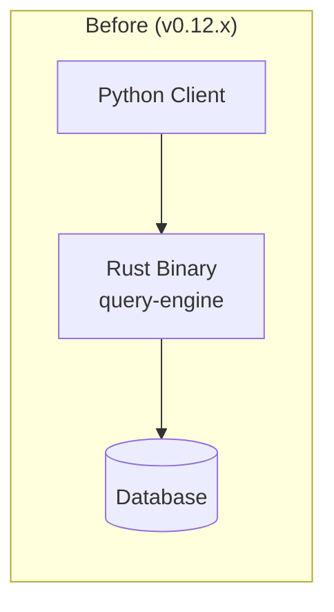
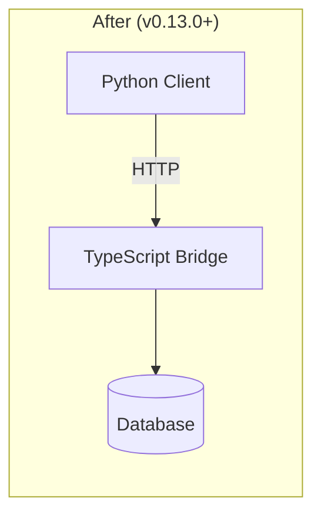
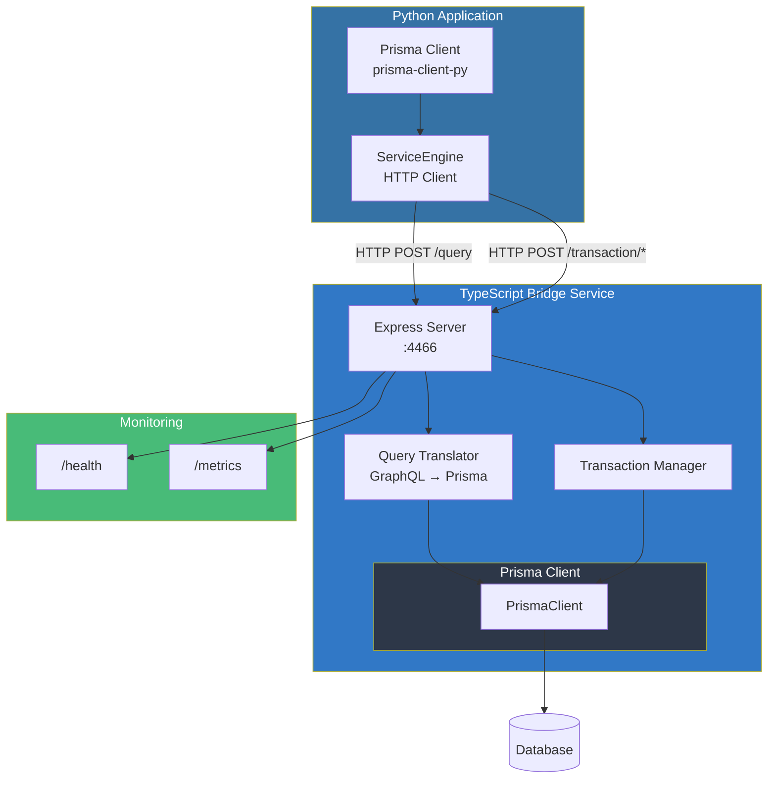
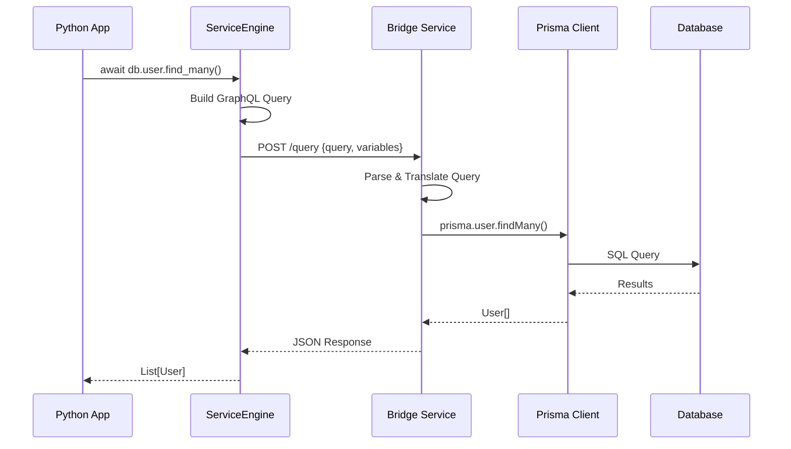

<br />

<div align="center">
    <h1>Prisma Client Python</h1>
    <p><h3 align="center">Type-safe database access for Python</h3></p>
    <div align="center">
    <a href="https://discord.gg/HpFaJbepBH">
        
    </a>
    <a href="https://prisma.io">
        
    </a>
    <a href="https://github.com/astral-sh/ruff">
        
    </a>
    
    
    </div>
</div>

> [!NOTE]
> **This is a community fork** that revives prisma-client-py with support for **Prisma 6+** using a TypeScript bridge architecture.
> See [MIGRATION.md](./MIGRATION.md) for upgrade instructions from the original project.

<hr>

## Table of Contents

- [What is Prisma Client Python?](#what-is-prisma-client-python)
- [Why This Fork?](#why-this-fork)
- [Architecture](#architecture)
- [Quick Start](#quick-start)
- [Documentation](#documentation)
- [Breaking Changes](#breaking-changes-from-v012x)
- [Production Deployment](#production-deployment)
- [Support](#support)

## What is Prisma Client Python?

Prisma Client Python is a next-generation ORM built on top of [Prisma](https://github.com/prisma/prisma) that has been designed from the ground up for ease of use and correctness.

[Prisma](https://www.prisma.io/) is a TypeScript ORM with zero-cost type safety for your database. This fork uses a **TypeScript bridge service** to interface with Prisma, enabling full compatibility with Prisma 6+ and beyond.

Prisma Client Python can be used in _any_ Python backend application. This can be a REST API, a GraphQL API or _anything_ else that needs a database.


> _Note that the only language server that is known to support this form of autocompletion is Pylance / Pyright._

## Why This Fork?

The original [prisma-client-py](https://github.com/RobertCraigie/prisma-client-py) was deprecated when Prisma moved from a Rust-based query engine to a TypeScript-based architecture in Prisma 5+/6+. This fork revives the project by:

1. **Using a TypeScript bridge service** instead of Rust binaries
2. **Wrapping the official `@prisma/client`** for full Prisma feature compatibility
3. **Maintaining the same Python API** - your existing code works unchanged

## Architecture

### What Changed?





### Detailed Architecture



### Request Flow



### Key Benefits

| Feature | Old (Rust Binary) | New (TypeScript Bridge) |
|---------|-------------------|-------------------------|
| Prisma Version | Limited to 4.x | Full 6.x+ support |
| Platform Support | Binary per platform | Universal (Node.js) |
| Binary Downloads | Required (~40MB) | Not needed |
| New Prisma Features | Blocked | Immediate access |
| Debugging | Limited | Full stack traces |

## Quick Start

### Prerequisites

- Python 3.8+
- Node.js 18+
- A supported database (PostgreSQL, MySQL, SQLite, etc.)

### Installation

```sh
# 1. Install the Python package
pip install -U prisma

# 2. Set up the TypeScript bridge
cd prisma-bridge
npm install

# 3. Configure your database
cp .env.example .env
# Edit .env with your DATABASE_URL
```

That's it! The bridge service **auto-starts** when you call `prisma.connect()` - just like the old binary engine.

### Basic Usage

```python
import asyncio
from prisma import Prisma

async def main() -> None:
    prisma = Prisma()
    await prisma.connect()

    # Create a user
    user = await prisma.user.create(
        data={
            'name': 'Alice',
            'email': 'alice@example.com'
        },
    )
    print(f"Created user: {user.name}")

    # Query users
    users = await prisma.user.find_many()
    print(f"All users: {users}")

    await prisma.disconnect()

if __name__ == '__main__':
    asyncio.run(main())
```

## Documentation

| Document | Description |
|----------|-------------|
| [MIGRATION.md](./MIGRATION.md) | Upgrade guide from v0.12.x to v0.13.0+ |
| [prisma-bridge/README.md](./prisma-bridge/README.md) | Bridge service setup and configuration |
| [docs/reference/service-engine.md](./docs/reference/service-engine.md) | Service engine technical reference |
| [docs/reference/binaries.md](./docs/reference/binaries.md) | Legacy binary engine docs (deprecated) |

### Core Features

- [Prisma Migrate](https://www.prisma.io/docs/concepts/components/prisma-migrate)
- [Full type safety](https://prisma-client-py.readthedocs.io/en/stable/getting_started/type-safety/)
- [With / without async](https://prisma-client-py.readthedocs.io/en/stable/getting_started/setup/)
- [Recursive and pseudo-recursive types](https://prisma-client-py.readthedocs.io/en/stable/reference/config/#recursive-type-depth)
- [Atomic updates](https://prisma-client-py.readthedocs.io/en/stable/reference/operations/#updating-atomic-fields)
- [Complex cross-relational queries](https://prisma-client-py.readthedocs.io/en/stable/reference/operations/#filtering-by-relational-fields)
- [Partial type generation](https://prisma-client-py.readthedocs.io/en/stable/reference/partial-types/)
- [Batching write queries](https://prisma-client-py.readthedocs.io/en/stable/reference/batching/)

### Supported Databases

- PostgreSQL
- MySQL
- SQLite
- CockroachDB
- MongoDB (experimental)
- SQL Server (experimental)

## Breaking Changes from v0.12.x

This fork introduces significant architectural changes. See [MIGRATION.md](./MIGRATION.md) for the full migration guide.

### Summary of Changes

| Change | Before | After |
|--------|--------|-------|
| Engine | Rust binary | TypeScript bridge service |
| Setup | `prisma py fetch` | `cd prisma-bridge && npm install` |
| Runtime | Binary process | HTTP service (port 4466) |
| Node.js | Not required | Required (v18+) |
| `engine_type` | `binary`, `library`, `dataproxy` | `service` (default) |

### Environment Variables

| Variable | Default | Description |
|----------|---------|-------------|
| `PRISMA_BRIDGE_URL` | `http://localhost:4466` | Bridge service URL |
| `PRISMA_BRIDGE_AUTO_START` | `true` | Auto-start bridge on connect (set `false` for Docker/manual) |
| `PRISMA_CONNECTION_LIMIT` | `10` | Database connection pool size |
| `PRISMA_POOL_TIMEOUT` | `10` | Pool timeout in seconds |
| `DATABASE_URL` | - | Your database connection string |

## Production Deployment

For production, you may want to run the bridge service separately (Docker, Kubernetes, etc.). Disable auto-start:

```sh
export PRISMA_BRIDGE_AUTO_START=false
export PRISMA_BRIDGE_URL=http://your-bridge-host:4466
```

### Docker Compose

```yaml
version: '3.8'
services:
  prisma-bridge:
    build: ./prisma-bridge
    ports:
      - "4466:4466"
    environment:
      - DATABASE_URL=${DATABASE_URL}
      - NODE_ENV=production
    healthcheck:
      test: ["CMD", "curl", "-f", "http://localhost:4466/health"]
      interval: 10s
      timeout: 5s
      retries: 3
    restart: unless-stopped

  your-app:
    build: .
    depends_on:
      prisma-bridge:
        condition: service_healthy
    environment:
      - PRISMA_BRIDGE_URL=http://prisma-bridge:4466
```

### Monitoring

The bridge service exposes:

| Endpoint | Description |
|----------|-------------|
| `GET /health` | Health check with database status |
| `GET /metrics` | Prometheus-compatible metrics |

Available metrics:
- `prisma_bridge_http_request_duration_seconds`
- `prisma_bridge_queries_total`
- `prisma_bridge_transactions_total`
- `prisma_bridge_errors_total`

## Support

Have any questions or need help using Prisma? Join the [community discord](https://discord.gg/HpFaJbepBH)!

If you don't want to join the discord you can also:

- Create a new [discussion](https://github.com/RobertCraigie/prisma-client-py/discussions/new)
- Open an [issue](https://github.com/RobertCraigie/prisma-client-py/issues/new)

## Contributing

We use [conventional commits](https://www.conventionalcommits.org) (also known as semantic commits) to ensure consistent and descriptive commit messages.

See the [contributing documentation](https://prisma-client-py.readthedocs.io/en/stable/contributing/contributing/) for more information.

## Attributions

This project would not be possible without the work of the amazing folks over at [prisma](https://www.prisma.io).

Massive h/t to [@steebchen](https://github.com/steebchen) for his work on [prisma-client-go](https://github.com/prisma/prisma-client-go) which was incredibly helpful in the creation of this project.

Original project by [@RobertCraigie](https://github.com/RobertCraigie).

## License

This project is licensed under the Apache-2.0 License - see the [LICENSE](./LICENSE) file for details.
